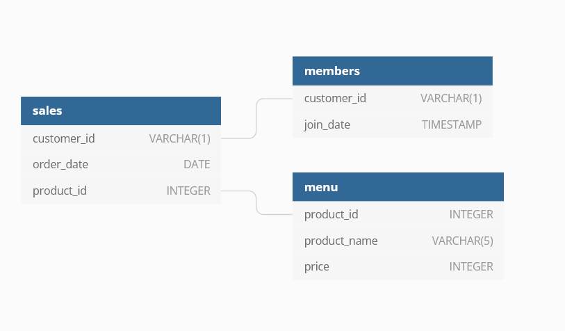

# Case Study # 1 : Danny's Dinner 
<p align="center">
  
</p>


## Context of Case study 
The owner of a little start up named DANNY'S DINER has called us to check the data of his bussiness and answer some questions about the new trends of his bussiness this answers also will be the fuel to start a new loyalty program for his customers .

Now we have a very good context and let's take a look at the dataset .

## Dataset 
The owner of the food start up shares with us the dataset of his clients , we will call the schema  `dannys dinner` and are composed of 3 tables :
```SQL 
SELECT *
FROM pg_indexes 
WHERE schemaname = 'dannys_diner';
```

* dannysdinner.sales
* dannysdinner.product_name
* dannysdinner.price

and the relationships between tables in the schema dannysdinner is as follows :
<<<<<<< HEAD
<p align="center">
  
</p>

### **sales : dannysdinner.sales**
In the first query we explored what are the columns of the table and what data types it stores .
- Customer_id
- order_date
- product_id

```SQL
SELECT *
FROM dannys_diner.sales 
LIMIT 5; 
```
| customer_id | order_date               | product_id |
|-------------|--------------------------|------------|
| A           | 2021-01-01T00:00:00.000Z | 1          |
| A           | 2021-01-01T00:00:00.000Z | 2          |
| A           | 2021-01-07T00:00:00.000Z | 2          |
| A           | 2021-01-10T00:00:00.000Z | 3          |
| A           | 2021-01-11T00:00:00.000Z | 3          |

and in this second query we identify how many rows our table has .

```SQL
SELECT COUNT(*) as total_rows
FROM dannys_diner.sales;
```

| total_rows |
|------------|
| 15         |


### **menu :dannyesdinner.menu**
In the first query we explored what are the columns of the table and what data types it stores .
- product_id
- product_name
- price
```SQL
SELECT *
FROM dannys_diner.menu
LIMIT 5 ; 
```
| product_id | product_name | price |
|------------|--------------|-------|
| 1          | sushi        | 10    |
| 2          | curry        | 15    |
| 3          | ramen        | 12    |

and in this second query we identify how many rows our table has .
```SQL
SELECT COUNT(*) as total_rows
FROM dannys_diner.menu;

```
| total_rows |
|------------|
| 3          |

### **members: dannysdinner.members**
In the first query we explored what are the columns of the table and what data types it stores .
- Customer_id
- join_date

```SQL
SELECT *
FROM dannys_dinner.members
LIMIT 5 ; 
```
| customer_id | join_date                |
|-------------|--------------------------|
| A           | 2021-01-07T00:00:00.000Z |
| B           | 2021-01-09T00:00:00.000Z |

and in this second query we identify how many rows our table has .
```SQL
SELECT *
FROM dannys_diner.members
LIMIT 5 ; 

```
| total_rows |
|------------|
| 2          |


**As we have explored our dataset we can conclude this dataset is too small and for that reason we clearly identified that it doesn't have null or duplicate records.**

**Once we have made this inference we can continue with the analysis stage.**

## Analysis Stage 
According to the ERD  , at this point we know what are the relationships with the tables and now we are gonna apply the corresponding join operations to consolidate our data in only one table .

```SQL
DROP TABLE IF EXISTS customer_data ;
CREATE TEMP TABLE customer_data AS 
SELECT 
sales.customer_id,
sales.order_date,
sales.product_id,
menu.price,
menu.product_name,
members.join_date  AS join_date 
FROM dannys_diner.sales AS sales 
FULL JOIN dannys_diner.menu AS menu 
ON menu.product_id = sales.product_id
FULL JOIN dannys_diner.members AS members
ON sales.customer_id = members.customer_id 
ORDER BY customer_id;
```
```SQL
SELECT *
FROM customer_data ;
```
### Owner Questions 
1. What is the total amount each customer spent at the restaurant?
```SQL
SELECT customer_id, SUM(price) as spend
FROM customer_data
GROUP BY customer_id
ORDER BY spend DESC; 
```
| customer_id | spend |
|-------------|-------|
| A           | 76    |
| B           | 74    |
| C           | 36    |

2. How many days has each customer visited the restaurant?
```SQL 
SELECT customer_id , COUNT(order_date) as days 
FROM customer_data 
GROUP BY customer_id
ORDER BY days DESC ; 
```
| customer_id | days |
|-------------|------|
| B           | 6    |
| A           | 6    |
| C           | 3    |

3. What was the first item from the menu purchased by each customer?
```SQL
WITH customer_product AS (
SELECT customer_id,
order_date,
product_name,
ROW_NUMBER() OVER(PARTITION BY customer_id ORDER BY order_date ASC) AS first_item 
FROM customer_data   
)

SELECT *
FROM customer_product 
WHERE first_item = 1 ;
```
| customer_id | order_date               | product_name | first_item |
|-------------|--------------------------|--------------|------------|
| A           | 2021-01-01T00:00:00.000Z | sushi        | 1          |
| B           | 2021-01-01T00:00:00.000Z | curry        | 1          |
| C           | 2021-01-01T00:00:00.000Z | ramen        | 1          |
4. What is the most purchased item on the menu and how many times was it purchased by all customers?
```SQL
SELECT product_name,COUNT(product_name) AS number_of_purchases 
FROM customer_data 
GROUP BY product_name
LIMIT 1 ; 
```
| product_name | number_of_purchases |
|--------------|---------------------|
| ramen        | 8                   |

5. Which item was the most popular for each customer?
```SQL
WITH most_purchased AS (
SELECT 
ROW_NUMBER() OVER (PARTITION BY customer_id) AS row_numbers,
customer_id ,
product_name,
COUNT(product_name)  as purchased 
FROM customer_data
GROUP BY customer_id , product_name
ORDER BY customer_id, purchased DESC
)

SELECT  *
FROM most_purchased
WHERE row_numbers = 1;
```
| row_numbers | customer_id | product_name | purchased |
|-------------|-------------|--------------|-----------|
| 1           | A           | ramen        | 3         |
| 1           | B           | ramen        | 2         |
| 1           | C           | ramen        | 3         |

6. Which item was purchased first by the customer after they became a member?
```SQL
WITH customer_order AS (
SELECT ROW_NUMBER() OVER(PARTITION BY customer_id  ORDER BY order_date ASC) AS ROW ,
customer_id,
order_date,
join_date,
product_name
FROM customer_data
WHERE join_date <= order_date
)

SELECT customer_id,order_date,product_name
FROM customer_order 
WHERE row = 1;
```
| customer_id | order_date               | product_name |
|-------------|--------------------------|--------------|
| A           | 2021-01-07T00:00:00.000Z | curry        |
| B           | 2021-01-11T00:00:00.000Z | sushi        |

7. Which item was purchased just before the customer became a member?
```SQL
WITH customer_order2 AS (
SELECT RANK() OVER(PARTITION BY customer_id  ORDER BY order_date DESC) AS ROW ,
customer_id,
order_date,
join_date,
product_name
FROM customer_data
WHERE join_date > order_date
)

SELECT customer_id,order_date,product_name
FROM customer_order2
WHERE ROW = 1 
ORDER BY product_name;
```
| customer_id | order_date               | product_name |
|-------------|--------------------------|--------------|
| A           | 2021-01-01T00:00:00.000Z | curry        |
| A           | 2021-01-01T00:00:00.000Z | sushi        |
| B           | 2021-01-04T00:00:00.000Z | sushi        |

8. What is the total items and amount spent for each member before they became a member?
```SQL
WITH customer_order3 AS (
SELECT ROW_NUMBER() OVER(PARTITION BY customer_id  ORDER BY order_date ASC) AS ROW ,
customer_id,
order_date,
join_date,
product_name,
price
FROM customer_data
WHERE join_date > order_date
)
SELECT customer_id,
COUNT(DISTINCT product_name) AS number_of_items , 
SUM(price) AS Total_spent
FROM customer_order3
GROUP BY customer_id;
```
| customer_id | number_of_items | total_spent |
|-------------|-----------------|-------------|
| B           | 2               | 40          |
| A           | 2               | 25          |

9. If each $1 spent equates to 10 points and sushi has a 2x points multiplier - how many points would each customer have?

```SQL
WITH customer_points AS (
SELECT customer_id,
CASE 
WHEN product_name = 'sushi' THEN price*2*10
ELSE price*10
END AS points
FROM customer_data
) 

SELECT customer_id,SUM(points) AS total_points
FROM customer_points
GROUP BY customer_id
ORDER BY total_points DESC;
```
| customer_id | total_points |
|-------------|--------------|
| B           | 940          |
| A           | 860          |
| C           | 360          |


10. In the first week after a customer joins the program (including their join date) they earn 2x points on all items, not just sushi - how many points do customer A and B have at the end of January?

```SQL 
SELECT customer_id , 
SUM(
CASE 
WHEN product_name = 'sushi' THEN price*2*10
WHEN order_date BETWEEN  join_date AND join_date::DATE + '6'::INTEGER   THEN price*2*10
ELSE price*10
END )AS points
FROM customer_data 
WHERE customer_id IN ('A','B') AND order_date <= '2021-01-31'
GROUP BY customer_id
ORDER BY points; 
```
| customer_id | points |
|-------------|--------|
| B           | 820    |
| A           | 1370   |

11.  Bonus question : Create another table that contains the columns : customer_id , order_date, product_name,price and the last one
must be called member and this column identifies when a customer did a purchase and was member at the same time (please identify members  with 'Y' and 'N' ) .

```SQL 
SELECT *
FROM customer_data ;

SELECT customer_id,order_date,product_name,price, 
CASE 
WHEN order_date >= join_date::DATE THEN 'Y' 
ELSE 'N' 
END as member
FROM customer_data
ORDER BY customer_id , order_date ; 


```

12. Bonus question : Add to our last table in the eleventh question a column called ranking an enumerate the purchases only when the customer had been a registered customer .
```SQL 
WITH table_ranking AS (
SELECT customer_id,order_date,product_name,price, 
CASE 
WHEN order_date >= join_date THEN 'Y' 
ELSE 'N' 
END as member
FROM customer_data
ORDER BY customer_id , order_date  
)

SELECT customer_id,order_date,product_name,price,member,
CASE 
WHEN member =  'Y' THEN RANK() OVER(PARTITION BY customer_id,member ORDER BY order_date)
ELSE  NULL
END AS ranking
FROM table_ranking;


```
