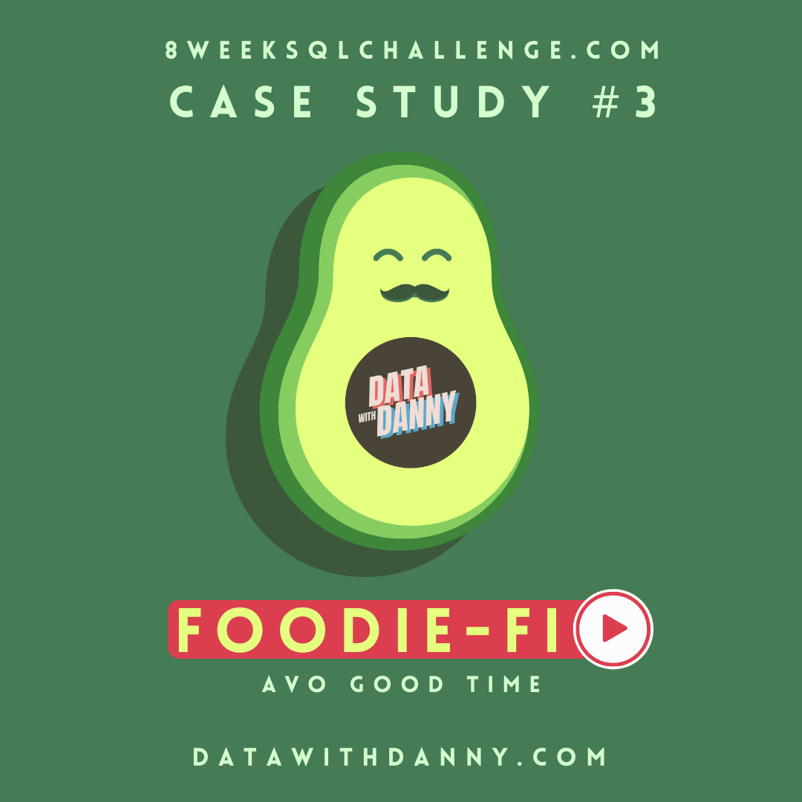

# Case Study # 3 : Foodie - Fi 

<p align="center">
  
</p>

## Context of the case Study 
We are in front of a new start-up based on subscription services just alike Netflix or Disney + this start-up also known as foodie-fi is a bussiness of food streaming and content related to food and its types .

Our customer (foodie-fi) has given to us a dataset about the subscriptions to get some insights about the bussiness and how can it grow with the results of this data analysis.

## Dataset 
The schema is named foodie_fi and contains two tables with information about the costumers an their subscription plans . 

1. **foodie_fi.plans** : This table contains all the plans in the bussiness and it has three columns : plan_id , plan_name and prince . 
```SQL 
SELECT *
FROM foodie_fi.plans
``` 
| plan_id | plan_name     | price  |
|---------|---------------|--------|
| 0       | trial         | 0.00   |
| 1       | basic monthly | 9.90   |
| 2       | pro monthly   | 19.90  |
| 3       | pro annual    | 199.00 |
| 4       | churn         | null   |

2. **foodie_fi.subscriptions** : This table contains all the information about the customer subscription and has columns like customer_id,plan_id_start_date . 

```SQL 
SELECT *
FROM foodie_fi.subscriptions
LIMIT 5 ; 
```
| customer_id | plan_id | start_date               |
|-------------|---------|--------------------------|
| 1           | 0       | 2020-08-01T00:00:00.000Z |
| 1           | 1       | 2020-08-08T00:00:00.000Z |
| 2           | 0       | 2020-09-20T00:00:00.000Z |
| 2           | 3       | 2020-09-27T00:00:00.000Z |
| 3           | 0       | 2020-01-13T00:00:00.000Z |

## Entity Relationship Diagram

The ERD helps us to understand the links between the tables and how could we implement the join . 

<p align="center">
  
</p>

## Customer Questions 


### **A. Customer Journey**

Based off the 8 sample customers provided in the sample from the subscriptions table, write a brief description about each customer’s onboarding journey.

Try to keep it as short as possible - you may also want to run some sort of join to make your explanations a bit easier!
```SQL 
DROP TABLE IF EXISTS foodie_start ;
CREATE TEMP TABLE foodie_start  AS 
SELECT 
s.customer_id ,
s.start_date,
s.plan_id,
p.plan_name,
p.price 
FROM foodie_fi.subscriptions AS s 
FULL JOIN foodie_fi.plans AS p 
ON s.plan_id = p.plan_id ; 

SELECT *
FROM foodie_start ; 
```
```
When a potential customer is interested in the bussiness decide take a trial plan to get a first look of the product then if he is still interested in the product he should pay for a subscription for a period of time monthly anual etc and this plan has a price , once a customer are subscribed in a trial plan or other .  he will get a customer_id and the start date of the plan , if he continue with the service this plan and price will change but the customer id remain the same . 
```


### **B. Data Analysis Questions**

1. How many customers has Foodie-Fi ever had?
```SQL
SELECT COUNT(*) AS #_of_customers
FROM foodie_fi.subscriptions;
```
| number_of_customers |
|---------------------|
| 2650                |

2. What is the monthly distribution of trial plan start_date values for our dataset - use the start of the month as the group by value
```SQL
WITH date_distribution AS (
SELECT
DATE_TRUNC('month',start_date::DATE) AS start_date
FROM foodie_fi.subscriptions)
SELECT 
start_date,
COUNT(*)
FROM date_distribution
GROUP BY start_date 
ORDER BY start_date;
```
| start_date               | count |
|--------------------------|-------|
| 2020-01-01T00:00:00.000Z | 88    |
| 2020-02-01T00:00:00.000Z | 68    |
| 2020-03-01T00:00:00.000Z | 94    |
| 2020-04-01T00:00:00.000Z | 81    |
| 2020-05-01T00:00:00.000Z | 88    |
| 2020-06-01T00:00:00.000Z | 79    |
| 2020-07-01T00:00:00.000Z | 89    |
| 2020-08-01T00:00:00.000Z | 88    |
| 2020-09-01T00:00:00.000Z | 87    |
| 2020-10-01T00:00:00.000Z | 79    |
| 2020-11-01T00:00:00.000Z | 75    |
| 2020-12-01T00:00:00.000Z | 84    |

3. What plan start_date values occur after the year 2020 for our dataset? Show the breakdown by count of events for each plan_name
```SQL
SELECT plan_name,
COUNT(*) AS counts
FROM foodie_start
WHERE start_date > '2020-12-31'
GROUP BY plan_name 
ORDER BY counts DESC;
```
| plan_name     | counts |
|---------------|--------|
| churn         | 71     |
| pro annual    | 63     |
| pro monthly   | 60     |
| basic monthly | 8      |

4. What is the customer count and percentage of customers who have churned rounded to 1 decimal place?
```SQL
SELECT
  SUM(CASE WHEN plan_id = 4 THEN 1 ELSE 0 END) AS churn_customers,
  ROUND(
    100 * SUM(CASE WHEN plan_id = 4 THEN 1 ELSE 0 END)::NUMERIC /
    COUNT(DISTINCT customer_id)::NUMERIC
  ,1) AS percentage
FROM foodie_fi.subscriptions;
```
| churn_customers | percentage |
|-----------------|------------|
| 307             | 30.7       |


5. How many customers have churned straight after their initial free trial - what percentage is this rounded to the nearest whole number?
```SQL
WITH ranked_plans AS (
  SELECT
    customer_id,
    plan_id,
    ROW_NUMBER() OVER (
      PARTITION BY customer_id
      ORDER BY start_date 
    ) AS plan_rank
  FROM foodie_fi.subscriptions
)
SELECT
  SUM(CASE WHEN plan_id = 4 THEN 1 ELSE 0 END) AS churn_customers,
  ROUND(
    100 * SUM(CASE WHEN plan_id = 4 THEN 1 ELSE 0 END)::NUMERIC /
    COUNT(*)::NUMERIC
  ,2) AS percentage
FROM ranked_plans
WHERE plan_rank = 2;
```
| churn_customers | percentage |
|-----------------|------------|
| 92              | 9.20       |

6. What is the number and percentage of customer plans after their initial free trial?
```SQL
WITH ranked_plans AS (
  SELECT
    customer_id,
    plan_id,
    ROW_NUMBER() OVER (
      PARTITION BY customer_id
      ORDER BY start_date 
    ) AS plan_rank
  FROM foodie_fi.subscriptions
)

SELECT
  plans.plan_id,
  plans.plan_name,
  COUNT(*) AS customer_count,
  ROUND(100 * COUNT(*) / SUM(COUNT(*)) OVER (),2) AS percentage
FROM ranked_plans
INNER JOIN foodie_fi.plans AS plans
  ON ranked_plans.plan_id = plans.plan_id
WHERE plan_rank = 2
GROUP BY plans.plan_id, plans.plan_name
ORDER BY plans.plan_id;
```
| plan_id | plan_name     | customer_count | percentage |
|---------|---------------|----------------|------------|
| 1       | basic monthly | 546            | 54.60      |
| 2       | pro monthly   | 325            | 32.50      |
| 3       | pro annual    | 37             | 3.70       |
| 4       | churn         | 92             | 9.20       |

7. What is the customer count and percentage breakdown of all 5 plan_name values at 2020-12-31?
```SQL
WITH valid_subscriptions AS (
  SELECT
    customer_id,
    plan_id,
    start_date,
    ROW_NUMBER() OVER (
      PARTITION BY customer_id
      ORDER BY start_date DESC
    ) AS plan_rank
  FROM foodie_fi.subscriptions
  WHERE start_date <= '2020-12-31'
),
summarised_plans AS (
  SELECT
    plan_id,
    COUNT(DISTINCT customer_id) AS customers
  FROM valid_subscriptions
  WHERE plan_rank = 1
  GROUP BY plan_id
 
)
SELECT
  plans.plan_id,
  plans.plan_name,
  customers,
  ROUND(
    100 * customers /
      SUM(customers) OVER (),
    1
  ) AS percentage
FROM summarised_plans
INNER JOIN foodie_fi.plans
  ON summarised_plans.plan_id = plans.plan_id
ORDER BY plans.plan_id ;
```
| plan_id | plan_name     | customers | percentage |
|---------|---------------|-----------|------------|
| 0       | trial         | 19        | 1.9        |
| 1       | basic monthly | 224       | 22.4       |
| 2       | pro monthly   | 326       | 32.6       |
| 3       | pro annual    | 195       | 19.5       |
| 4       | churn         | 236       | 23.6       |

8. How many customers have upgraded to an annual plan in 2020?
```SQL
DROP TABLE IF EXISTS foodie_start ;
CREATE TEMP TABLE foodie_start  AS 
SELECT 
ROW_NUMBER() OVER(PARTITION BY customer_id ORDER BY start_date DESC),
s.customer_id ,
s.start_date,
s.plan_id,
p.plan_name,
p.price 
FROM foodie_fi.subscriptions AS s 
FULL JOIN foodie_fi.plans AS p 
ON s.plan_id = p.plan_id 
WHERE start_date BETWEEN '2020-01-01' AND '2020-12-31' AND plan_name LIKE '%annual'
; 

SELECT COUNT(*)
FROM foodie_start ; 
```
| count |
|-------|
| 195   |

9. How many days on average does it take for a customer to an annual plan from the day they join Foodie-Fi?
```SQL
DROP TABLE IF EXISTS foodie_start ;
CREATE TEMP TABLE foodie_start  AS 
SELECT 
s.customer_id ,
s.start_date,
s.plan_id,
p.plan_name,
p.price 
FROM foodie_fi.subscriptions AS s 
FULL JOIN foodie_fi.plans AS p 
ON s.plan_id = p.plan_id ; 

WITH trials AS (
SELECT 
customer_id,
start_date,
plan_id
FROM foodie_start 
WHERE plan_id = 0
),
annual_plan AS (
SELECT 
customer_id,
start_date,
plan_id
FROM foodie_start 
WHERE plan_id = 3
)
SELECT 
--ap.customer_id,
--ap.start_date AS annual_plan_date,
--t.start_date AS trial_date
CEILING(AVG(DATE_PART('days',ap.start_date::TIMESTAMP - t.start_date::TIMESTAMP)))
FROM annual_plan as ap
INNER JOIN trials as t
ON ap.customer_id = t.customer_id
```
10. Can you further breakdown this average value into 30 day periods (i.e. 0-30 days, 31-60 days etc)
```SQL
WITH annual_plan AS (
  SELECT
    customer_id,
    start_date
  FROM foodie_fi.subscriptions
  WHERE plan_id = 3
),
trial AS (
  SELECT
    customer_id,
    start_date
  FROM foodie_fi.subscriptions
  WHERE plan_id = 0
),
annual_days AS (
SELECT
  DATE_PART(
      'days',
      annual_plan.start_date::TIMESTAMP -
        trial.start_date::TIMESTAMP
    )::INTEGER AS duration
FROM annual_plan
INNER JOIN trial
  ON annual_plan.customer_id = trial.customer_id
),COUNTS AS (
SELECT
 (30* (annual_days.duration / 30) || ' - ' || ((30 * (annual_days.duration / 30))+30 )|| ' days')::TEXT AS breakdown_period,
  COUNT(*)AS customers
FROM annual_days
GROUP BY breakdown_period,annual_days.duration
ORDER BY annual_days.duration)

SELECT breakdown_period , SUM(customers) AS customers
FROM COUNTS 
GROUP BY breakdown_period 
ORDER BY breakdown_period,customers;
```
11. How many customers downgraded from a pro monthly to a basic monthly plan in 2020?
```SQL
WITH ranked_plans AS (
SELECT
  customer_id,
  plan_id,
  start_date,
  LAG(plan_id) OVER (
      PARTITION BY customer_id
      ORDER BY start_date
  ) AS lag_plan_id
FROM foodie_fi.subscriptions
WHERE DATE_PART('year', start_date) = 2020
)
SELECT
  COUNT(*)
FROM ranked_plans
WHERE lag_plan_id = 1 AND plan_id = 2;
```
### **C. Challenge Payment Question**

The Foodie-Fi team wants you to create a new payments table for the year 2020 that includes amounts paid by each customer in the subscriptions table with the following requirements:

* Monthly payments always occur on the same day of month as the original start_date of any monthly paid plan

* Upgrades from basic to monthly or pro plans are reduced by the current paid amount in that month and start immediately

* Upgrades from pro monthly to pro annual are paid at the end of the current billing period and also starts at the end of the month period

* Once a customer churns they will no longer make payments
```SQL
WITH lead_plans AS (
SELECT
  customer_id,
  plan_id,
  start_date,
  LEAD(plan_id) OVER (
      PARTITION BY customer_id
      ORDER BY start_date
    ) AS lead_plan_id,
  LEAD(start_date) OVER (
      PARTITION BY customer_id
      ORDER BY start_date
    ) AS lead_start_date
FROM foodie_fi.subscriptions
WHERE DATE_PART('year', start_date)::INTEGER != 2021
AND plan_id != 0
),-- case 1: non churn monthly customers
case_1 AS (
SELECT
  customer_id,
  plan_id,
  start_date,
  DATE_PART('mon', AGE('2020-12-31'::DATE, start_date))::INTEGER AS month_diff
FROM lead_plans
WHERE lead_plan_id is null
-- not churn and annual customers
AND plan_id NOT IN (3, 4)
),
-- generate a series to add the months to each start_date
case_1_payments AS (
  SELECT
    customer_id,
    plan_id,
    (start_date + GENERATE_SERIES(0, month_diff) * INTERVAL '1 month')::DATE AS start_date
  FROM case_1
),
-- case 2: churn customers
case_2 AS (
  SELECT
    customer_id,
    plan_id,
    start_date,
    DATE_PART('mon', AGE(lead_start_date - 1, start_date))::INTEGER AS month_diff
  FROM lead_plans
  -- churn accounts only
  WHERE lead_plan_id = 4
),
case_2_payments AS (
  SELECT
    customer_id,
    plan_id,
    (start_date + GENERATE_SERIES(0, month_diff) * INTERVAL '1 month')::DATE AS start_date
  from case_2
),
-- case 3: customers who move from basic to pro plans
case_3 AS (
  SELECT
    customer_id,
    plan_id,
    start_date,
    DATE_PART('mon', AGE(lead_start_date - 1, start_date))::INTEGER AS month_diff
  FROM lead_plans
  WHERE plan_id = 1 AND lead_plan_id IN (2, 3)
),
case_3_payments AS (
  SELECT
    customer_id,
    plan_id,
    (start_date + GENERATE_SERIES(0, month_diff) * INTERVAL '1 month')::DATE AS start_date
  from case_3
),
-- case 4: pro monthly customers who move up to annual plans
case_4 AS (
  SELECT
    customer_id,
    plan_id,
    start_date,
    DATE_PART('mon', AGE(lead_start_date - 1, start_date))::INTEGER AS month_diff
  FROM lead_plans
  WHERE plan_id = 2 AND lead_plan_id = 3
),
case_4_payments AS (
  SELECT
    customer_id,
    plan_id,
    (start_date + GENERATE_SERIES(0, month_diff) * INTERVAL '1 month')::DATE AS start_date
  from case_4
),
-- case 5: annual pro payments
case_5_payments AS (
  SELECT
    customer_id,
    plan_id,
    start_date
  FROM lead_plans
  WHERE plan_id = 3
),
-- union all where we union all parts
union_output AS (
  SELECT * FROM case_1_payments
  UNION
  SELECT * FROM case_2_payments
  UNION
  SELECT * FROM case_3_payments
  UNION
  SELECT * FROM case_4_payments
  UNION
  SELECT * FROM case_5_payments
  
)
SELECT
  customer_id,
  plans.plan_id,
  plans.plan_name,
  start_date AS payment_date,
  -- price deductions are applied here
  CASE
    WHEN union_output.plan_id IN (2, 3) AND
      LAG(union_output.plan_id) OVER w = 1
    THEN plans.price - 9.90
    ELSE plans.price
    END AS amount,
  RANK() OVER w AS payment_order
FROM union_output
INNER JOIN foodie_fi.plans
  ON union_output.plan_id = plans.plan_id
-- where filter for outputs for testing
WHERE customer_id IN (1, 2, 7, 11, 13, 15, 16, 18, 19, 25, 39)
WINDOW w AS (
  PARTITION BY union_output.customer_id
  ORDER BY customer_id,start_date
);
```

### **D. Outside The Box Questions**

The following are open ended questions which might be asked during a technical interview for this case study - there are no right or wrong answers, but answers that make sense from both a technical and a business perspective make an amazing impression!

1. How would you calculate the rate of growth for Foodie-Fi?
```
We can calculate the company's growth through analize all the subscriptions with time series first per year then per month and identify if we can see a trend . 
```
2. What key metrics would you recommend Foodie-Fi management to track over time to assess performance of their overall business?
```
- New customers per month
- How many customers downgraded their plan and why 
- How many customers upgraded their plan and why 
- What is the monthly percentage of churn 
```
3. What are some key customer journeys or experiences that you would analyse further to improve customer retention?
```
- What are your most favorite content ?
- What kind of meals do you like ?
- Improve the variety of content 
- Make content for pro versions 
```
4. If the Foodie-Fi team were to create an exit survey shown to customers who wish to cancel their subscription, what questions would you include in the survey?
```
"We are sad to see you go , please answer this questions to understand what could we do better ? "
- The contents are always the same ?
- You can not connect properly to the app ?
- Do you find the app expensive ?
```
5. What business levers could the Foodie-Fi team use to reduce the customer churn rate? How would you validate the effectiveness of your ideas?
```
- Open new content for pro users to motivate other users to upgrade their account 
- Make a pyramid scheme to invite friends and win rewards like discounts or upgrades
- Make a space for influencers and creators of content to give some publicity to the app 
- Give rewards and status to older users
```