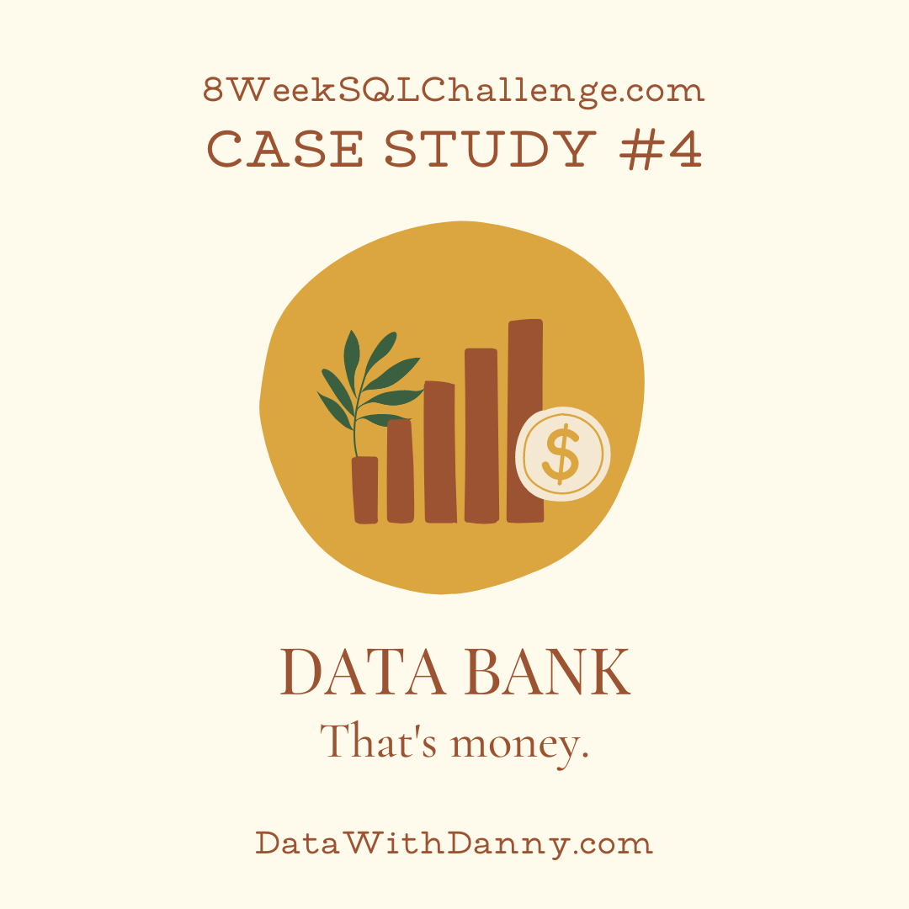

# Case Study # 4 : Data Bank
<p align="center">
  
</p>

## Context of the case Study 
This case of study is about a Digital Bank with some variations first of all this digital bank also provides storage information services for the customer .

The clientes are in the cloud and they have some space of storage in that cloud depending on how much money do they have in their accounts.

Now the main situation of this bussiness is a strategy to increase their customer database and figure out how much storage they will need .

## Dataset 
This dataset  is made up of 3 tables and we will see how are this tables distributed and what data types does we have .
### **1. data_bank.regions** 
Just like popular cryptocurrency platforms - Data Bank is also run off a network of nodes where both money and data is stored across the globe. In a traditional banking sense - you can think of these nodes as bank branches or stores that exist around the world.

This regions table contains the region_id and their respective region_name values .

```SQL 
SELECT *
FROM data_bank.regions 
LIMIT 5  ; 
```

### **2. data_customer_nodes** 
Customers are randomly distributed across the nodes according to their region - this also specifies exactly which node contains both their cash and data.

This random distribution changes frequently to reduce the risk of hackers getting into Data Bank’s system and stealing customer’s money and data!

Below is a sample of the top 10 rows of the data_bank.customer_nodes.

```SQL 
SELECT *
FROM data_bank.customer_transactions
LIMIT 5 ; 
```
### **3. data_bank.customer_transactions** 
This table stores all customer deposits, withdrawals and purchases made using their Data Bank debit card.

```SQL 
SELECT *
FROM data_bank.regions 
LIMIT 5  ; 
```

## Entity Relationship Diagram
<p align="center">
  
</p>


## Customer Questions 
### A. Customer Nodes Exploration
1. How many unique nodes are there on the Data Bank system?
```SQL 
WITH combinations AS (
SELECT 
DISTINCT 
region_id,
node_id
FROM data_bank.customer_nodes
)
SELECT COUNT(*) AS different_branches
FROM combinations ; 
```
2. What is the number of nodes per region?
```SQL 
WITH combinations AS (
SELECT 
DISTINCT 
region_id,
node_id
FROM data_bank.customer_nodes
)
SELECT region_id, COUNT(*) AS different_nodes
FROM combinations
GROUP BY region_id; 
```
3. How many customers are allocated to each region?

```SQL 
SELECT r.region_name,COUNT(DISTINCT cn.customer_id) AS nodes
FROM data_bank.customer_nodes AS cn
FULL JOIN data_bank.regions AS r
ON r.region_id  = cn.region_id
GROUP BY  r.region_name 
ORDER BY nodes DESC; 
```
4. How many days on average are customers reallocated to a different node?

```SQL 
-- step 1: create a table with row numbers and duration
DROP TABLE IF EXISTS ranked_customer_nodes;
CREATE TEMP TABLE ranked_customer_nodes AS
SELECT
  customer_id,
  node_id,
  region_id,
  DATE_PART('day', AGE(end_date ,start_date))::INTEGER AS duration,
  ROW_NUMBER() OVER (PARTITION BY customer_id ORDER BY start_date) AS rn
FROM data_bank.customer_nodes;

WITH RECURSIVE output_table AS (
  SELECT
    customer_id,
    node_id,
    duration,
    rn,
    1 AS run_id
  FROM ranked_customer_nodes
  WHERE rn = 1

  UNION ALL

  SELECT
    t1.customer_id,
    t2.node_id,
    t2.duration,
    t2.rn,
    -- update run_id if the node_id values do not match
    CASE
      WHEN t1.node_id != t2.node_id THEN t1.run_id + 1
      ELSE t1.run_id
      END AS run_id
  FROM output_table AS t1
  INNER JOIN ranked_customer_nodes AS t2
    ON t1.rn + 1 = t2.rn
    AND t1.customer_id = t2.customer_id
    AND t2.rn > 1
),
cte_customer_nodes AS (
  SELECT
    customer_id,
    run_id,
    MAX(duration) AS node_duration
  FROM output_table
  GROUP BY
    customer_id,
    run_id
)
SELECT
  ROUND(AVG(node_duration)) AS average_node_duration
FROM cte_customer_nodes;
```
5. What is the median, 80th and 95th percentile for this same reallocation days metric for each region?

```SQL 
WITH RECURSIVE output_table AS (
  SELECT
    customer_id,
    node_id,
    region_id,
    duration,
    rn,
    1 AS run_id
  FROM ranked_customer_nodes  -- using the temp table we created previously
  WHERE rn = 1

  UNION ALL

  SELECT
    t1.customer_id,
    t2.node_id,
    t2.region_id,
    t2.duration,
    t2.rn,
    -- update run_id if the node_id values do not match
    CASE
      WHEN t1.node_id != t2.node_id THEN t1.run_id + 1
      ELSE t1.run_id
      END AS run_id
  FROM output_table t1
  INNER JOIN ranked_customer_nodes t2
    ON t1.rn + 1 = t2.rn
    AND t1.customer_id = t2.customer_id
    And t2.rn > 1
),
cte_customer_nodes AS (
  SELECT
    customer_id,
    run_id,
    region_id,
    MAX(duration) AS node_duration
  FROM output_table
  GROUP BY
    customer_id,
    run_id,
    region_id
)
SELECT
  regions.region_name,
  ROUND(PERCENTILE_CONT(0.5) WITHIN GROUP (ORDER BY regions.region_id)) AS median_node_duration,
  ROUND(PERCENTILE_CONT(0.8) WITHIN GROUP (ORDER BY run_id)) AS pct80_node_duration,
  ROUND(PERCENTILE_CONT(0.95) WITHIN GROUP (ORDER BY customer_id)) AS pct95_node_duration
FROM cte_customer_nodes
FULL JOIN data_bank.regions
  ON cte_customer_nodes.region_id = regions.region_id
GROUP BY regions.region_name, regions.region_id
ORDER BY regions.region_id;
```

### B. Customer Transactions

1. What is the unique count and total amount for each transaction type?

```SQL 
SELECT txn_type,COUNT(*),SUM(txn_amount)
FROM data_bank.customer_transactions
GROUP BY txn_type ; 
```
2. What is the average total historical deposit counts and amounts for all customers?

```SQL 
WITH deposit_counts AS (
SELECT *
FROM data_bank.customer_transactions
WHERE txn_type = 'deposit'
),
transaction_per_customer AS (
SELECT  customer_id ,AVG(txn_amount) AS average_per_customer , COUNT(*) AS transaction_counts
FROM deposit_counts 
GROUP BY customer_id)

SELECT ROUND(AVG(average_per_customer)) as avg_deposit  , ROUND(AVG(transaction_counts)) as avg_txn_count
FROM transaction_per_customer ; 
```
3. For each month - how many Data Bank customers make more than 1 deposit and either 1 purchase or 1 withdrawal in a single month?

```SQL 
WITH cte_customer_months AS (
  SELECT
    DATE_TRUNC('mon', txn_date)::DATE AS month,
    customer_id,
    SUM(CASE WHEN txn_type = 'deposit' THEN 1 ELSE 0 END) AS deposit_count,
    SUM(CASE WHEN txn_type = 'purchase' THEN 1 ELSE 0 END) AS purchase_count,
    SUM(CASE WHEN txn_type = 'withdrawal' THEN 1 ELSE 0 END) AS withdrawal_count
  FROM data_bank.customer_transactions
  GROUP BY month, customer_id
)
SELECT
  month,
  COUNT(DISTINCT customer_id) AS customer_count
FROM cte_customer_months
WHERE deposit_count > 1 AND (
  purchase_count >= 1 OR withdrawal_count >= 1
)
GROUP BY month
ORDER BY month;
```
4. What is the closing balance for each customer at the end of the month?
```SQL
SELECT
  DATE_TRUNC('mon', txn_date)::DATE AS month,
  COUNT(customer_id) AS record_count
FROM data_bank.customer_transactions
GROUP BY month
ORDER BY month;
```
```SQL 


WITH cte_monthly_balances AS (
  SELECT
    customer_id,
    DATE_TRUNC('mon', txn_date)::DATE AS month,
    SUM(
      CASE
        WHEN txn_type = 'deposit' THEN txn_amount
        ELSE (-txn_amount)
        END
    ) AS balance
  FROM data_bank.customer_transactions
  GROUP BY customer_id, month
  ORDER BY customer_id, month
),
cte_generated_months AS (
  SELECT
    DISTINCT customer_id,
    (
      '2020-01-01'::DATE +
      GENERATE_SERIES(0, 3) * INTERVAL '1 MONTH'
    )::DATE AS month
  FROM data_bank.customer_transactions
)
SELECT
  cte_generated_months.customer_id,
  cte_generated_months.month,
  COALESCE(cte_monthly_balances.balance, 0) AS balance_contribution,
  SUM(cte_monthly_balances.balance) OVER (
    PARTITION BY  cte_generated_months.customer_id
    ROWS BETWEEN UNBOUNDED PRECEDING AND CURRENT ROW
  ) AS ending_balance
  FROM cte_generated_months
LEFT JOIN cte_monthly_balances
  ON cte_generated_months.month = cte_monthly_balances.month
  AND cte_generated_months.customer_id = cte_monthly_balances.customer_id
WHERE cte_generated_months.customer_id BETWEEN 1 AND 3 
ORDER BY customer_id,month;
```
5. Comparing the closing balance of a customer’s first month and the closing balance from their second nth, what percentage of customers:
    - Have a negative first month balance?
    - Have a positive first month balance?
    - Increase their opening month’s positive closing balance by more than 5% in the following month?
    - Reduce their opening month’s positive closing balance by more than 5% in the following month?
    - Move from a positive balance in the first month to a negative balance in the second month?

```SQL 
WITH cte_monthly_balances AS (
  SELECT
    customer_id,
    DATE_TRUNC('mon', txn_date)::DATE AS month,
    SUM(
      CASE
        WHEN txn_type = 'deposit' THEN txn_amount
        ELSE (-txn_amount)
        END
    ) AS balance
  FROM data_bank.customer_transactions
  GROUP BY customer_id, month
  ORDER BY customer_id, month
),
cte_generated_months AS (
  SELECT
    customer_id,
    (
      DATE_TRUNC('mon', MIN(txn_date))::DATE +
      GENERATE_SERIES(0, 1) * INTERVAL '1 MONTH'
    )::DATE AS month,
    GENERATE_SERIES(1, 2) AS month_number
  FROM data_bank.customer_transactions
  GROUP BY customer_id
),
cte_monthly_transactions AS (
  SELECT
    cte_generated_months.customer_id,
    cte_generated_months.month,
    cte_generated_months.month_number,
    COALESCE(cte_monthly_balances.balance, 0) AS transaction_amount
  FROM cte_generated_months
  LEFT JOIN cte_monthly_balances
    ON cte_generated_months.month = cte_monthly_balances.month
    AND cte_generated_months.customer_id = cte_monthly_balances.customer_id
),
cte_monthly_aggregates AS (
  SELECT
    customer_id,
    month_number,
    LAG(transaction_amount) OVER (
      PARTITION BY customer_id
      ORDER BY month
    ) AS previous_month_transaction_amount,
    transaction_amount
  FROM cte_monthly_transactions
),
cte_calculations AS (
  SELECT
    COUNT(DISTINCT customer_id) AS customer_count,
    SUM(CASE WHEN previous_month_transaction_amount > 0 THEN 1 ELSE 0 END) AS positive_first_month,
    SUM(CASE WHEN previous_month_transaction_amount < 0 THEN 1 ELSE 0 END) AS negative_first_month,
    SUM(CASE
          WHEN previous_month_transaction_amount > 0
            AND transaction_amount > 0
            AND transaction_amount >= 1.05 * previous_month_transaction_amount
            THEN 1
          ELSE 0
        END
    ) AS increase_count,
    SUM(
      CASE
        WHEN previous_month_transaction_amount > 0
          AND transaction_amount < 0
          AND transaction_amount < -1.05 * previous_month_transaction_amount
          THEN 1
        ELSE 0
      END
    ) AS decrease_count,
    SUM(
      CASE
        WHEN previous_month_transaction_amount > 0
          AND transaction_amount < 0
          AND transaction_amount <-previous_month_transaction_amount
            THEN 1
        ELSE 0 END
    ) AS negative_count
  FROM cte_monthly_aggregates
  WHERE previous_month_transaction_amount IS NOT NULL
)
SELECT
  ROUND(100 * positive_first_month / customer_count, 2) AS positive_pc,
  ROUND(100 * negative_first_month / customer_count, 2) AS negative_pc,
  ROUND(100 * increase_count / positive_first_month, 2) AS increase_pc,
  ROUND(100 * decrease_count / positive_first_month, 2) AS decrease_pc,
  ROUND(100 * negative_count / positive_first_month, 2) AS negative_balance_pc
FROM cte_calculations;
```