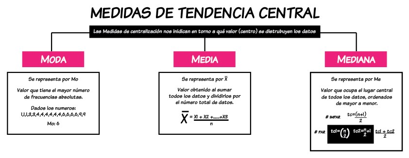
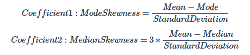

# Revision : Estadistica Basica en SQL 
En la siguiente revision se realizará una generalizacion de la estadistica basica que se puede computar 
en SQL mediante consultas o queries .

Para realizar esta tarea debemos recordar lo que son las medidas de tendencia central en estadistica .


### 1. Media en SQL 
Para este caso utilizaremos el set de datos health.user_logs con el fin de realizar la demostracion de estas medidas iniciando con la media .  
```SQL 
SELECT AVG(measure_value) AS Media
FROM health.user_logs;
```
| media                 |
|-----------------------|
| 1986.2288605267024675 |

En la linea anterior se calculó la media de la columna measure_value , como muestra del funcionamiento del calculo , debemos tener en cuenta que en este contexto este valor de media no tiene sentido ya que el measure_value tiene relacionadas medidas como presion arterial , glucosa en sangre y demas que no son operables desde un sentido logico .

Por lo tanto : 
```SQL 
SELECT measure , ROUND (AVG(measure_value),2) as media , COUNT(*) AS recuento 
FROM health.user_logs
GROUP BY measure
ORDER BY media ;
```
| measure        | media    | recuento |
|----------------|----------|----------|
| blood_pressure | 95.40    | 2417     |
| blood_glucose  | 177.35   | 38692    |
| weight         | 28786.85 | 2782     |

En este caso tenemos un valor atipico en la medida weight o peso ya que esta media no corresponde a un valor logico de esta variable , por lo tanto debemos explorar mas adelante el set de datos para corroborar errores o datos atipicos .

### 2. Mediana y moda 
En este caso el sintaxis correcto para la medicion de la mediana y la moda esta descrito en las siguientes tablas , lo que estamos haciendo en este apartado es hallar la mediana y la moda de los datos de peso o weight con el fin de esclarecer el valor de su media tan inconsistente .
``` SQL 
-- Media , mediana y moda 
SELECT  ROUND(AVG(measure_value),2)AS meanv
,PERCENTILE_CONT(0.5) WITHIN GROUP(ORDER BY measure_value) AS medianv 
,MODE() WITHIN GROUP(ORDER BY measure_value) AS modev
FROM health.user_logs
WHERE measure = 'weight' ; 
```
| meanv    | medianv      | modev       |
|----------|--------------|-------------|
| 28786.85 | 75.976721975 | 68.49244787 |

Como podemos observar hay una clara presencia de datos atipicos que hace que haya una desviacion importante de la media , esta desviacion en un modo mas tecnico se puede observar como un skew o sesgo en la distribucion de datos .

### 3 . Maximo , minimo y rango 
Un simple y excelente metodo para hallar estos datos atipicos es a traves de la medicion del maximo y minimo de los datos a traves de las funciones , se presentaran dos clases de metodos para este calculo .

**Metodo 1** : 
Se crea una tabla con las funciones y sus respectivos calculos , este metodo consume memoria pero es mas simple en su escritura . 
``` SQL 
-- Maximo y minimo 
SELECT 
MIN(measure_value) as minimum,
MAX(measure_value) as maximum,
MAX(measure_value) - MIN(measure_value) as Range 
FROM health.user_logs
WHERE measure = 'weight' ; 
```
| minimum | maximum  | range    |
|---------|----------|----------|
| 0       | 39642120 | 39642120 |

**Metodo 2** :
Este metodo funciona de la misma manera utiliza CTE para guardar una seccion de la tabla con la referencia "ranges" en donde se utiliza menos memoria y su sintaxis es un poco mas compleja . 

Importante !! ```EXPLAIN ANALYZE  ``` nos muestra los requerimientos en terminos de computo que tiene ejecutar nuestro codigo .
``` SQL 
EXPLAIN ANALYZE
WITH ranges AS (
SELECT
MIN (measure_value) AS minimum,
MAX (measure_value) AS maximum
FROM health.user_logs
WHERE measure = 'weight'
)
SELECT 
minimum,
maximum,
maximum - minimum AS Range 
FROM ranges ;
```
| QUERY PLAN                                                                                                                    |
|-------------------------------------------------------------------------------------------------------------------------------|
| Limit  (cost=1118.40..1118.42 rows=1 width=96) (actual time=58.919..58.924 rows=1 loops=1)                                    |
|   ->  Subquery Scan on ranges  (cost=1118.40..1118.42 rows=1 width=96) (actual time=58.916..58.919 rows=1 loops=1)            |
|         ->  Aggregate  (cost=1118.40..1118.41 rows=1 width=64) (actual time=58.910..58.911 rows=1 loops=1)                    |
|               ->  Seq Scan on user_logs  (cost=0.00..1104.64 rows=2752 width=5) (actual time=0.058..55.357 rows=2782 loops=1) |
|                     Filter: (measure = 'weight'::text)                                                                        |
|                     Rows Removed by Filter: 41109                                                                             |
| Planning Time: 0.859 ms                                                                                                       |
| Execution Time: 59.050 ms                                                                                                     |
### 4. Varianza y desviacion estandar 
Como parte de la revision de estadistica basica en SQL  tenemos las medidas de dispersion de datos , la varianza y la desviacion estandar las cuales funcionan a modo de identificar el grado de desviacion de los datos con respecto a su media  . 

En este caso queremos calcular la varianza y desviacion estandar de los datos weight para identificar la dispersion de los datos , como resultado la desviacion estandar tiene un valor bastante alto lo que conlleva a que identifiquemos que los datos tengan una gran variabilidad.
``` SQL 
WITH spread AS (
SELECT VARIANCE(measure_value) AS varianza,
STDDEV(measure_value) AS destandar,
AVG(measure_value) AS media ,
PERCENTILE_CONT(0.5) WITHIN GROUP(ORDER BY (measure_value)) AS mediana ,
MODE() WITHIN GROUP(ORDER BY (measure_value)) AS moda 
FROM health.user_logs
WHERE measure = 'weight'
)
SELECT varianza , destandar,media,mediana,moda 
FROM spread ;
```
| varianza                         | destandar                  | media              | mediana      | moda        |
|----------------------------------|----------------------------|--------------------|--------------|-------------|
| 1129457862383.414293789530531301 | 1062759.550596189323085400 | 28786.846657295953 | 75.976721975 | 68.49244787 |

Por lo tanto listamos los datos de peso del set e identificamos que existen tres datos atipicos en nuestro set .
``` SQL 
SELECT measure_value , COUNT(*) AS values 
FROM health.user_logs
WHERE measure = 'weight'
GROUP BY measure_value
ORDER BY measure_value DESC
LIMIT 10 ;
```
| measure_value | values |
|---------------|--------|
| 39642120      | 2      |
| 576484        | 1      |
| 200.487664    | 1      |
| 190.4         | 1      |
| 188.69427     | 1      |
| 186.8799      | 1      |
| 185.51913     | 1      |
| 175.086512    | 1      |
| 173.725736    | 1      |
| 170.5506      | 3      |

### Resumen estadistico SQL 
``` SQL
-- Resumen Estadistico 
SELECT
-- Datos a analizar 
  'weight' AS measure,
  -- Minimo 
  ROUND(MIN(measure_value), 2) AS minimum_value,
  -- Maximo 
  ROUND(MAX(measure_value), 2) AS maximum_value,
  -- Media 
  ROUND(AVG(measure_value), 2) AS mean_value,
  -- Mediana 
  ROUND(CAST(PERCENTILE_CONT(0.5) WITHIN GROUP (ORDER BY measure_value) AS NUMERIC),2) AS median_value,
  -- Moda 
  ROUND(MODE() WITHIN GROUP (ORDER BY measure_value),2) AS mode_value,
  -- Desviacion estandar 
  ROUND(STDDEV(measure_value), 2) AS standard_deviation,
  -- Varianza 
  ROUND(VARIANCE(measure_value), 2) AS variance_value
FROM health.user_logs
WHERE measure = 'weight';
```
| measure | minimum_value | maximum_value | mean_value | median_value | mode_value | standard_deviation | variance_value   |
|---------|---------------|---------------|------------|--------------|------------|--------------------|------------------|
| weight  | 0.00          | 39642120.00   | 28786.85   | 75.98        | 68.49      | 1062759.55         | 1129457862383.41 |

**Ejercicios** : 

 1 . What is the average, median and mode values of blood glucose values to 2 decimal places?
``` SQL 

SELECT 
'blood_glucose' as measure,
ROUND (AVG(measure_value),2) AS MEDIA, 
MIN(measure_value) AS MINIMO,
MAX(measure_value) AS MAXIMO  , 
ROUND(MODE() WITHIN GROUP(ORDER BY (measure_value)),2) AS MODA ,  
ROUND(CAST(PERCENTILE_CONT(0.5) WITHIN GROUP (ORDER BY measure_value) AS NUMERIC),2) AS MEDIANA ,
ROUND(VARIANCE(measure_value),2) AS VARIANZA,
ROUND(STDDEV(measure_value),2) AS D_ESTANDAR 
FROM health.user_logs
WHERE measure = 'blood_glucose' ; 
```
| measure       | media  | minimo | maximo | moda   | mediana | varianza   | d_estandar |
|---------------|--------|--------|--------|--------|---------|------------|------------|
| blood_glucose | 177.35 | -1     | 227228 | 401.00 | 154.00  | 1339396.62 | 1157.32    |


2 . What is the most frequently occuring measure_value value for all blood glucose measurements?
``` SQL 
SELECT  measure_value, COUNT(*) as counts 
FROM health.user_logs
WHERE measure = 'blood_glucose'
GROUP BY measure_value 
ORDER BY counts desc; 
```
| measure_value | counts |
|---------------|--------|
| 401           | 433    |
| 117           | 350    |
| 118           | 307    |
| 115           | 290    |
| 126           | 290    |
| 122           | 289    |
| 108           | 287    |
| 123           | 283    |
| 125           | 282    |
| 120           | 281    |


3 . Calculate the 2 Pearson Coefficient of Skewness for blood glucose measures given the following formulas:


``` SQL 
WITH skew AS (

SELECT 
'blood_glucose' AS measure,
ROUND(AVG(measure_value),2) AS MEDIA,
ROUND(MODE() WITHIN GROUP(ORDER BY measure_value),2) AS MODA , 
ROUND(CAST(PERCENTILE_CONT(0.5) WITHIN GROUP (ORDER BY measure_value) AS NUMERIC),2) AS MEDIANA ,
ROUND(STDDEV(measure_value),2) AS D_ESTANDAR
FROM health.user_logs
WHERE measure = 'blood_glucose'
)


SELECT (MEDIA - MODA)/ (D_ESTANDAR) AS coeff1 ,3*((MEDIA - MEDIANA)/ (D_ESTANDAR)) AS coeff2
FROM skew ; 

```
| coeff1                  | coeff2                 |
|-------------------------|------------------------|
| -0.19324819410361870528 | 0.06052777105727024505 |
