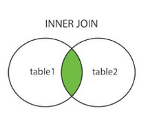
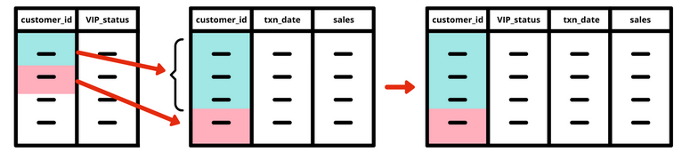
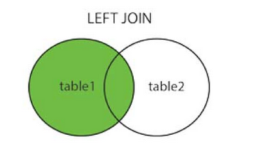
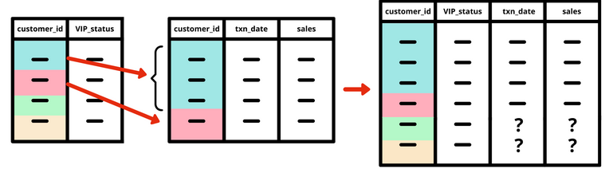
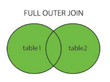
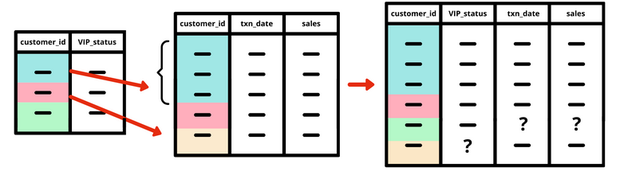
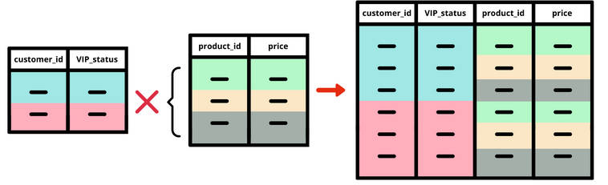
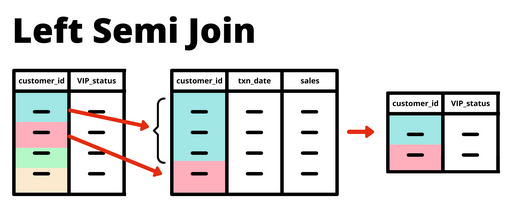
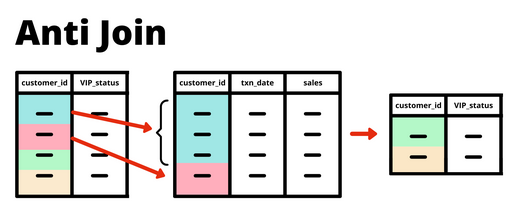
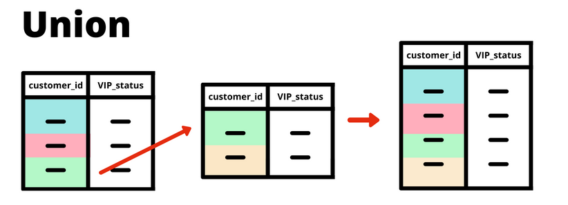

# Revision : Table Joins en SQL 
Los Join son poderosas herramientas para solicitar informacion a traves de una conexion entre dos o mas tablas , dependiendo de la naturaleza de nuestros datos podemos aplicar alguna tecnica de Join a un  Database con el fin de computar operaciones rigurosas que dependan de informacion consignada en diferentes tablas .
Como ejemplo practico a continuacion se presenta la siguiente tabla con los influencers mas notables en el mundo de los datos .

Como primer paso se crean dos tablas que son interdependientes ya que estan relacionadas con la columna iid
```SQL 
DROP TABLE IF EXISTS names ;
CREATE TEMP TABLE names AS 
WITH input_data (iid,first_name,title) AS (
VALUES 
 (1, 'Kate', 'Datacated Visualizer'),
 (2, 'Eric', 'Captain SQL'),
 (3, 'Danny', 'Data Wizard Of Oz'),
 (4, 'Ben', 'Mad Scientist'),
 (5, 'Dave', 'Analytics Heretic'),
 (6, 'Ken', 'The YouTuber')
)

SELECT * FROM input_data;

DROP TABLE IF EXISTS jobs;
CREATE TEMP TABLE jobs AS 
WITH input_data (iid,occupation,salary) AS (
 VALUES
 (1, 'Cleaner', 'High'),
 (2, 'Janitor', 'Medium'),
 (3, 'Monkey', 'Low'),
 (6, 'Plumber', 'Ultra'),
 (7, 'Hero', 'Plus Ultra')
)
SELECT * FROM input_data;
```
Una vez creadas las tablas procedemos a inspeccionar sus datos con el fin de establecer el nombre de sus columnas y los valores comunes .
```SQL 
SELECT * FROM names;
```

```SQL 
SELECT * FROM jobs;
```
## Inner Join 
Un Inner Join o Join es usado para obtener la interseccion entre dos tablas y retornar solo los registros que componen esta interseccion .
<p align="center">
  
</p>
En este ejemplo se realizará la operacion con las tablas names y iid para obtener informacion respectiva. 
<p align="center">
  
</p>

```SQL 
SELECT names.iid,
names.first_name,
names.title,
jobs.occupation,
jobs.salary 
FROM names 
INNER JOIN jobs 
ON names.iid = jobs.iid ; 
```
Es indispensable tomar en consideracion que la condicion que se denota despues de la clausula ON se cumple sin importar si las tablas no tienen la misma extension , por lo que si miramos las tablas jobs y names por separado encontraremos que una tiene 7 registros y la otra 6 por lo que mediante ```names.iid = jobs.iid ``` filtraremos aquellos registros que hacen match entre las dos tablas .
## Left Join 
En esta operacion tomamos la interseccion de dos tablas pero mantenemos los registros de la primer tabla o left table , 
<p align="center">
  
</p>

Query de lef join 

<p align="center">
  
</p>

```SQL 
SELECT
  names.iid,
  names.first_name,
  names.title,
  jobs.occupation,
  jobs.salary
FROM names
LEFT JOIN jobs
  ON names.iid = jobs.iid;
```
de manera inversa tenemos 
```SQL 
SELECT
  names.iid,
  names.first_name,
  names.title,
  jobs.occupation,
  jobs.salary
FROM jobs
LEFT JOIN names
  ON jobs.iid = names.iid
```
## Full Join
El Full Join es ampliamente utilizado en casos donde debemos mantener los mismos registros de las dos tablas en una sola , como consecuencia a esto algunas filas pueden llegar a tener valores de null en caso tal de que las tablas no hagan match completo entre sus registros . 

<p align="center">
  
</p>

la siguiente consulta o query ejemplifica el uso correcto de full join 
<p align="center">
  
</p>

```SQL 
SELECT
  names.iid AS name_id,
  jobs.iid AS job_id,
  names.first_name,
  names.title,
  jobs.occupation,
  jobs.salary
FROM names
FULL JOIN jobs
  ON names.iid = jobs.iid;
```
## Aliasing o notacion de los Join 
Este concepto de Aliasing se utiliza principalmente para organizar la notacion de nuestros Join , esta notacion depende de como trabajemos con nuestro equipo de trabajo o simplemente que metodo de aliasing estamos utilizando si trabajamos por nuestra cuenta. 
### 1. Aliasing con la primer letra 
Este aliasing consiste en sintetizar al nombre de la tabla hasta tal punto de colocar las iniciales o la primer letra de esta en nuestro join 
es aconsejable utilizarlo cuando tenemos nombres pequeños en nuestra base de datos y no tan aconsejable cuando estamos trabajando con una  base de datos que tiene muchas tablas . 
Ejemplo con la query de names y jobs 
```SQL 
SELECT 
n.iid as name_iid,
j.iid as job_iid,
n.first_namme,
n.title,
j.occupation,
j.salary
FROM names AS n 
FULL JOIN jobs AS j
ON n.iid = j.iid; 

```
### 2. Logical Aliasing o notacion logica 
El Logical aliasing no es mas que denotar nuestras tablas con nombres logicos , sintetizando aquellos nombres muy largos en palabras faciles de recordar y de rastrear , con la utilizacion de esta tecnica es aconsejable comentar el query con la informacion necesaria para que otro usuario pueda conocer los nombres originales o la informacion mas sensible de este aliasing .
```SQL
SELECT
  sales.user_id,
  names.first_name,
  names.last_name
FROM financial.customer_sales_daily AS sales
INNER JOIN financial.customer_name_details AS names
  ON sales.customer_id = names.customer_id

```
Como vemos en este ejemplo el nombre ```financial.customer_name_details ``` es demasiado largo para trabajar con el por lo tanto se sintetizó con el nombre ``` sales ``` . 

### 3. Appearance Order Aliasing (AOA)
Por ultimo este tipo de aliasing utiliza una letra ```t``` para denotar tabla y un numero de 1 a hasta el numero de tablas de la base de datos es decir que la primer tabla de nuestra base puede ser t1 , esto es muy util cuando concemos muy bien la base que estamos manejando y como estan organizadas las tablas .
```SQL
SELECT
  t1.iid AS name_iid,
  t2.iid AS job_iid,
  t1.first_name,
  t1.title,
  t2.occupation,
  t2.salary
FROM names AS t1
FULL JOIN jobs AS t2
  ON t1.iid = t2.iid;
```
## Cross Join 
El Cross Join es un calculo que demanda grandes requerimientos a nivel de procesamiento , en sintesis realiza el producto cartesiano entre dos tablas con el fin de crear una nueva , es util cuando se necesita una tabla resultante producto de la mezcla de dos tablas para una aplicacion especifica . 
<p align="center">
  
</p>

Para este caso tenemos dos maneras de escribir la misma consulta generando el mismo resultado .
```SQL
-- Sintaxis general 
SELECT
  names.iid as name_iid,
  jobs.iid as job_iid,
  names.first_name,
  names.title,
  jobs.occupation,
  jobs.salary
FROM names
CROSS JOIN jobs;

-- Sintaxis comun 
SELECT
  names.iid AS name_iid,
  jobs.iid AS job_iid,
  names.first_name,
  names.title,
  jobs.occupation,
  jobs.salary
FROM names, jobs;
```
## Joins avanzados 
Los Joins avanzados consiten en tecnicas con tablas que permiten acceder a sus datos y a la vez filtrar estos .
### 1. Left Semi Join 
El left semi Join es un tipo de Join que permite capturar las coincidencias exactas entre dos tablas , no otorga valores null y su resultado solo tiene las columnas de la tabla izquierda como se muestra en la imagen. 

Sintaxis de left Semi Join
``` SQL 
SELECT 
table1.column1,
table1.column2
FROM table1
WHERE EXISTS(
SELECT column1
FROM table2
WHERE table1.column1 = table2.column1
)
``` 
La parte del codigo WHERE EXISTS denota a aquellos registros que existen en la tabla1 y tambien en la tabla 2 relacionados por la column1 

### 2. Anti Join 
El Anti Join considera filtrar aquellos registros que no se encuentran en las dos tablas , es decir que filtra todo aquello que no tiene un match exacto entre las tablas que queremos consultar .
Acorde a la imagen .


``` SQL 
SELECT 
table1.column1,
table1.column2
FROM table1
WHERE NOT EXISTS(
SELECT column1
FROM table2
WHERE table1.column1 = table2.column1
)
``` 

## Operaciones de sets
Estos metodos se utilizan para realizar filtros de union , interseccion y excepcion , estas operaciones solo pueden llevarse a cabo cuando los sets tengan columnas con los mismos tipos de datos .

### Union 
La union es una opracion simple , se encarga de unir dos sets con condiciones especificadas . 

``` SQL
SELECT * 
FROM Table1
WHERE column1 = 'one'
UNION 
SELECT *
FROM table1
WHERE column1 = 'two'
``` 
De esta manera el output será una tabla que contenga dos filas con los datos de one y two filtrados previamente de la column1

### Union All 
Union All es una variacion de Union ya que este primero une las coincidencias de la tabla pero sin aplicar DISTINCT a los valores .


``` SQL 
SELECT * FROM table1 where column1 = 'one'
UNION ALL
SELECT * FROM table1 where column1 = 'one';
``` 
Esto retornará una tabla de los valores one que hallan en nuestro set de datos .

### Intersect 
Intersecto solo filtra aquello que esta exactamente en las dos tablas como lo muestra la siguiente imagen . 


```SQL
SELECT * FROM TABLE1
INTERSECT 
SELECT * FROM TABLE1 WHERE LEFT (column1,1) = 'K';
``` 
Esto retornará una tabla con los registros exactos que comparten las dos tablas . 

### Except 
Except es un equivalente del ANTI JOIN , considera aquellos datos que no son registros exactos en la tabla . 


```SQL
SELECT * FROM TABLE1
EXCEPT
SELECT * FROM TABLE1 WHERE LEFT (column1,1) = 'K';
``` 
