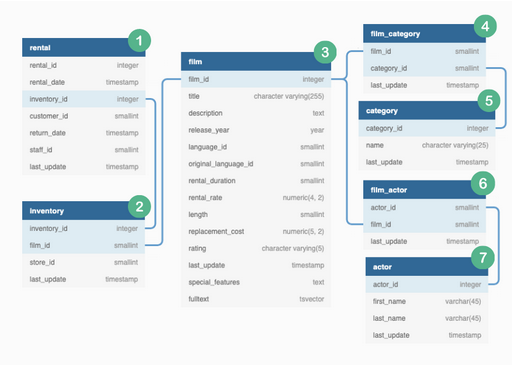
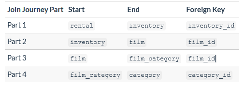
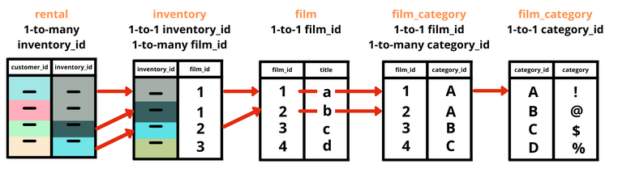
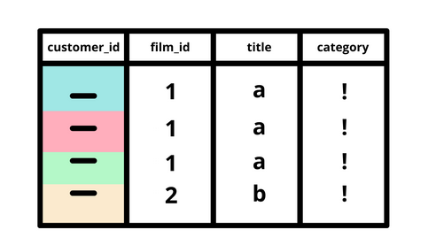

# Revision : Caso de Estudio Marketing 
## Estructura del proyecto 


## Estructura de los datos ERD
<p align="center">
  
</p>

## Diseñar el plan de trabajo 
Como primer paso debemos realizar la delimitacion del proyecto , es decir cuales son los outputs y como estan estructurados los datos con el fin de realizar las respectivas operaciones y los Joins correctos para navegar por la base de datos .
### ***Definicion del estado final***
Debemos generar las siguientes columnas a traves de operaciones en SQL con el fin de obtener los siguientes datos .

1. **category_name** : El nombre de las dos principales categorias segun el consumo del cliente .
2. **rental_count** : Cuantas peliculas en total ha visto el cliente en esta categoria .
3. **average_comparison** : Cuantas peliculas ha visto el cliente en comparacion con el promedio . 
4. ***percentile***: En que lugar del top se encuentra este cliente comparado con los demas en esta categoria . 
5. ***category_percentage*** : Que proporcion de peliculas vio en total en esta categoria . 

### ***Ingenieria Inversa***
Esto se traduce en la identificacion de las columnas clave que necesitamos para empezar el estudio y como se relacionan con las demas tablas de nuestro dataset .

### ***Identificar las columnas clave y los puntos de inicio y fin de busqueda***


De esta manera realizamos un plan de como navegar a lo largo de las tablas de la base de datos .

## Decidir cual tipo de Join utilizar 
Esta parte es importante pues acorde al Join utilizado asi mismo estaremos filtrando nuestros datos para llegar a aquellos que necesitamos .
Para respondernos esta parte de que Join utilizar debemos preguntarnos . 
1. Cual es el proposito de aplicar Join en las tablas ?
2. Cual es la distribucion de las claves externas o foreign keys dentro de cada tabla ?
3. Cuantos valores unicos de claves externas o foreign keys existen en cada tabla ?

Una vez respondidas estas preguntas obtendremos todas las herramientas para comenzar a filtrar nuestros datos .

###  ***Definir el proposito*** 
Nuestro proposito es simple si podemos delimitarlo a traves de los outputs de nuestro proyecto , como se ve en la tabla de ERD a partir de la tabla rental debemos realizar operaciones con joins para llegar a la tabla de categorias y asi computar las preferencias de cada usuario respecto a lo que consume en peliculas .

### ***Formulacion de preguntas analiticas*** 
Como una muestra de el analisis entre nuestras tablas tenemos que la tabla rental e inventory deben relacionarse mediante una clave externa o foreign key en este caso es inventory_id por lo tanto en este analisis debemos realizar estas dos preguntas .
1. Cuantos registros existen por inventory_id en las tablas a relacionar ?
2. Cuantos valores de foregin key estan superpuestos y/o faltantes entre las dos tablas ?
### ***Hipotesis***
En un orden mas preciso debemos generar hipotesis que permitan establecer como lo datos estan distribuidos .
1. El Numero de registros unicos de ***inventory_id***  sera igual en las dos tablas rental y inventory .
2. Habran multiples registros por un unico  ***inventory_id*** en la tabla rentals .
3. Habran multiples registros de ***inventory_id*** por cada ***film_id*** en la tabla inventory .

### ***Validar hipotesis con datos***
1.El Numero de registros unicos de ***inventory_id***  sera igual en las dos tablas rental y inventory .
``` SQL 
SELECT COUNT(DISTINCT inventory_id)
FROM dvd_rentals.rental; 
```

``` SQL 
SELECT COUNT(DISTINCT inventory_id)
FROM dvd_rentals.inventory; 
```
Los valores de ambas tablas son diferentes por lo tanto esto invalida nuestra hipotesis .

2.Habrán multiples registros por un unico  ***inventory_id*** en la tabla rentals .
``` SQL 
WITH counts_base AS (
SELECT 
inventory_id as target_column_values ,
COUNT(*) AS row_counts
FROM dvd_rentals.rental
GROUP BY target_column_values
)
SELECT 
row_counts
COUNT(target_column_values) AS count_of_target_values
FROM counts_base
GROUP BY row_counts
ORDER BY row_counts ;
``` 
3.Habrán multiples registros de ***inventory_id*** por cada ***film_id*** en la tabla inventory .
```SQL
WITH multiple AS (
SELECT film_id , COUNT(inventory_id) as invid
FROM dvd_rentals.inventory
GROUP BY film_id
ORDER BY film_id)

SELECT invid,COUNT(film_id) AS filmid
FROM multiple
GROUP BY invid
ORDER BY invid;
```
### Respondiendo las preguntas analiticas a traves de hipotesis 
Uno de los conceptos claves que hay que verificar antes de generar cada join es mirar la distribucion de los datos que tiene la foreign key esto nos dará una excelente vista de aquello que queremos relacionar entre las tablas .

mediante nuestro analisis nos damos cuenta que la tabla inventory tiene 1 registro adicional en comparacion con la tabla rental en la foreign key .

Un analisis adicional es verificar si los valores de foreign key se encuentran en las dos tablas exactamente iguales sin importar este registro de mas , esto con el fin de corroborar si podemos aplicar un join y que estas dos tablas en realidad pueden relacionarse .


mediante las siguientes lineas de codigo procedemos a corroborar esta relacion entre las tablas .

Para la tabla rental 

```SQL
-- how many foreign keys only exist in the left table and not in the right?
SELECT
  COUNT(DISTINCT rental.inventory_id)
FROM dvd_rentals.rental
WHERE NOT EXISTS (
  SELECT inventory_id
  FROM dvd_rentals.inventory
  WHERE rental.inventory_id = inventory.inventory_id
);
 ```
Para la tabla inventory 

```SQL 
-- how many foreign keys only exist in the right table and not in the left?
-- note the table reference changes
SELECT
  COUNT(DISTINCT inventory.inventory_id)
FROM dvd_rentals.inventory
WHERE NOT EXISTS (
  SELECT inventory_id
  FROM dvd_rentals.rental
  WHERE rental.inventory_id = inventory.inventory_id
);
```

Existe un registro de más con respecto a rental esto puede deberse a que este registro corresponde a una pelicula que no ha sido rentada aun o no ha sido consumida por ningun cliente hasta el momento .

verificando sus datos tenemos 

```SQL
SELECT *
FROM dvd_rentals.inventory
WHERE NOT EXISTS (
  SELECT inventory_id
  FROM dvd_rentals.rental
  WHERE rental.inventory_id = inventory.inventory_id
);
```
Una vez se ha corroborado esta informacion nos queda aplicar el join , puede ser un inner join o un left  join ya que reconoceemos cual es la logica de los registros que faltan en nuestra tabla rental , por consiguiente concluimos que no afecta de gran manera el desarrollo del proyecto . 

## Implementar el JOIN 
### ***Join a partir de left join***
```SQL 
DROP TABLE IF EXISTS left_rental_join;
CREATE TEMP TABLE left_rental_join AS 
SELECT 
rental.customer_id,
rental.inventory_id,
inventory.film_id
FROM dvd_rentals.rental
LEFT JOIN dvd_rentals.inventory
ON rental.inventory_id = inventory.inventory_id;
```
### ***Join a partir de INNER join***
```SQL
DROP TABLE IF EXISTS inner_rental_join;
CREATE TEMP TABLE inner_rental_join AS
SELECT
  rental.customer_id,
  rental.inventory_id,
  inventory.film_id
FROM dvd_rentals.rental
INNER JOIN dvd_rentals.inventory
  ON rental.inventory_id = inventory.inventory_id;
```
### ***Ejecución***
```SQL 
(
  SELECT
    'left join' AS join_type,
    COUNT(*) AS record_count,
    COUNT(DISTINCT inventory_id) AS unique_key_values
  FROM left_rental_join
)
UNION
(
  SELECT
    'inner join' AS join_type,
    COUNT(*) AS record_count,
    COUNT(DISTINCT inventory_id) AS unique_key_values
  FROM inner_rental_join
);
```
## Implementar el Join en las siguientes tablas 
Como primer tarea despues de hacer nuestro analisis de las tablas rental e inventory debemos combinar la informacion de la primer parte y continuar haciendo Joins en las siguientes tablas , en esta ocasion debemos consolidar la informacion que hay en las tablas .
```dvd_rentals.inventory``` y ```dvd_rentals.film``` por lo tanto debemos responder las mismas preguntas de la primer parte .

***1. Con que proposito hacemos el join en estas tablas ?***
Queremos unir la columna film_id de las dos tabals con el fin de obtener la columna title de cada pelicula .
  ***a.Cuales Hipotesis debemos tener en cuenta con estos datos ?***

  Entre la tabla inventory y film se encuentra la columna film_id en donde tenemos una relacion de 1 a muchos debido a que una pelicula en especifico podria tener multiples copias en inventario .
  Hay una relacion 1 a 1 entre film_id y las filas de  dvd_rentals.film por lo tanto no tendria sentido que hubiesen duplicados entre las tablas por lo que debemos comprobar este aspecto . 

  ***b.Como podemos validar o rechazar estas hipotesis ?***
  Para validar estas suposiciones generamos un conteo de las filas para film_id en ambas tablas inventory y film , esto tambien nos colabora con el numeral 2 de nuestras preguntas diagnosticas . 

  ```SQL
  WITH base_counts AS (
SELECT
  film_id,
  COUNT(*) AS record_count
FROM dvd_rentals.inventory
GROUP BY film_id
)
SELECT
  record_count,
  COUNT(DISTINCT film_id) as unique_film_id_values
FROM base_counts
GROUP BY record_count
ORDER BY record_count;
  ```
Podemos confirmar que tenemos una relacion de 1 a muchos entre film_id como foreign key en la tabla inventory .
```SQL 
SELECT
  film_id,
  COUNT(*) AS record_count
FROM dvd_rentals.film
GROUP BY film_id
ORDER BY record_count DESC
LIMIT 5;


```
De acuerdo a la anterior consulta podemos conlcuir que existe una relacion 1 a 1 entre las foreign key .


***2. Cual es la distribucion de los datos en las foreign keys dentro de cada tabla ?***
En la comprobacion de nuestras hipotesis realizamos este analisis por lo cual confirmamos que la distribucion de nuestros datos de foregin keys es la misma en ambas tablas . 

***3. Cuantos valores unicos de foreign key existen en cada tabla ?***
Mediante una consulta anti-join consideramos aquellos registros que se encuentran repetidos o excluidos entre las dos tablas , por lo que : 

```SQL
SELECT
  COUNT(DISTINCT inventory.film_id)
FROM dvd_rentals.inventory
WHERE NOT EXISTS (
  SELECT film_id
  FROM dvd_rentals.film
  WHERE film.film_id = inventory.film_id
);
```
Por lo tanto podemos concluir que todos los film_id de la tabla de inventario existen en la tabla de film .

En la siguiente consulta realizamos la comprobacion de que todos los registros de film_id estan en inventario .

```SQL
SELECT
  COUNT(DISTINCT film.film_id)
FROM dvd_rentals.film
WHERE NOT EXISTS (
  SELECT film_id
  FROM dvd_rentals.inventory
  WHERE film.film_id = inventory.film_id
);
```
Por lo tanto tenemos que los registros de film_id de la tabla film sobrepasan los de la misma categoria de la tabla inventario .
Finalmente contaremos los valores unicos de foreign key que se generan cuando usamos left semi join en la tabla inventario como nuestra base .

```SQL
SELECT
  COUNT(DISTINCT film_id)
FROM dvd_rentals.inventory
-- note how the NOT is no longer here for a left semi join
-- compared to the anti join!
WHERE EXISTS (
  SELECT film_id
  FROM dvd_rentals.film
  WHERE film.film_id = inventory.film_id
);


```

Por lo tanto debemos esperar un total de 958 registros al realizar un join entre estas dos tablas . 

Por lo tanto al implementar nuestro Join entre las tablas .

```SQL
DROP TABLE IF EXISTS left_join_part_2;
CREATE TEMP TABLE left_join_part_2 AS
SELECT
  inventory.inventory_id,
  inventory.film_id,
  film.title
FROM dvd_rentals.inventory
LEFT JOIN dvd_rentals.film
  ON film.film_id = inventory.film_id;

DROP TABLE IF EXISTS inner_join_part_2;
CREATE TEMP TABLE inner_join_part_2 AS
SELECT
  inventory.inventory_id,
  inventory.film_id,
  film.title
FROM dvd_rentals.inventory
INNER JOIN dvd_rentals.film
  ON film.film_id = inventory.film_id;

-- check the counts for each output (bonus UNION usage)
-- note that these parantheses are not really required but it makes
-- the code look and read a bit nicer!
(
  SELECT
    'left join' AS join_type,
    COUNT(*) AS record_count,
    COUNT(DISTINCT film_id) AS unique_key_values
  FROM left_join_part_2
)
-- we can use UNION ALL here because we do not need UNION for distinct values!
UNION ALL
(
  SELECT
    'inner join' AS join_type,
    COUNT(*) AS record_count,
    COUNT(DISTINCT film_id) AS unique_key_values
  FROM inner_join_part_2
);
```

## Realizar un Join entre las partes 1 y 2 
De esta manera nuestras primeras tres tablas han quedado con un join multiple .
```SQL
DROP TABLE IF EXISTS join_parts_1_and_2;
CREATE TEMP TABLE join_parts_1_and_2 AS
SELECT
  rental.customer_id,
  inventory.film_id,
  film.title
FROM dvd_rentals.rental
INNER JOIN dvd_rentals.inventory
  ON rental.inventory_id = inventory.inventory_id
INNER JOIN dvd_rentals.film
  ON inventory.film_id = film.film_id;

SELECT * FROM join_parts_1_and_2 limit 10;
```

## Join General 
Inner Join 
```SQL 
DROP TABLE IF EXISTS complete_joint_dataset;
CREATE TEMP TABLE complete_joint_dataset AS
SELECT
  rental.customer_id,
  inventory.film_id,
  film.title,
  film_category.category_id,
  category.name AS category_name
FROM dvd_rentals.rental
INNER JOIN dvd_rentals.inventory
  ON rental.inventory_id = inventory.inventory_id
INNER JOIN dvd_rentals.film
  ON inventory.film_id = film.film_id
INNER JOIN dvd_rentals.film_category
  ON film.film_id = film_category.film_id
INNER JOIN dvd_rentals.category
  ON film_category.category_id = category.category_id;

SELECT * FROM complete_joint_dataset limit 10;
```
Left Join 
```SQL 
DROP TABLE IF EXISTS complete_left_join_dataset;
CREATE TEMP TABLE complete_left_join_dataset AS
SELECT
  rental.customer_id,
  inventory.film_id,
  film.title,
  category.name AS category_name
FROM dvd_rentals.rental
LEFT JOIN dvd_rentals.inventory
  ON rental.inventory_id = inventory.inventory_id
LEFT JOIN dvd_rentals.film
  ON inventory.film_id = film.film_id
LEFT JOIN dvd_rentals.film_category
  ON film.film_id = film_category.film_id
LEFT JOIN dvd_rentals.category
  ON film_category.category_id = category.category_id;

SELECT
  'left join' AS join_type,
  COUNT(*) AS final_record_count
FROM complete_left_join_dataset
UNION
SELECT
  'inner join' AS join_type,
  COUNT(*) AS final_record_count
FROM complete_joint_dataset;

```
De esta manera tenemos de modo general 

y nuestro resultado final de esta operacion de Joins
