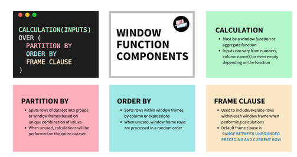
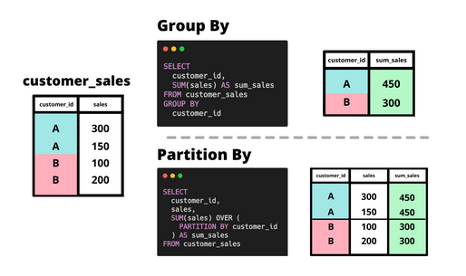
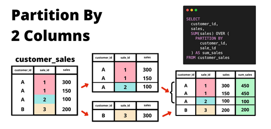
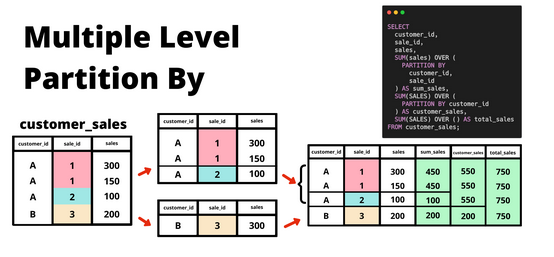

# Revision : Window Functions 
En esta revision realizaremos el cubrimiento de las funciones window mas importantes 
y como aplicarlas en diferentes escenarios con datos .

Las Windonw Functions son operaciones o calculos ejecutados en ventanas o grupos de filas 
Se caracterizan por tener las siguientes partes : 


## 1. Funcion Partition by Basica

Basicamente la funcion partition by divide la tabla por los resultados que le indicamos a diferencia de group by que realiza operaciones en torno al resultado , como se observa en la imagen partition by nos permite agrupar en la misma tabla por una clave especifica y asi mismo filtrar los datos .
``` SQL
DROP TABLE IF EXISTS customer_sales;
CREATE TEMP TABLE customer_sales AS 
WITH input_data (customer_id,sales) AS (
VALUES 
('A',300),
('A',150),
('B',100),
('B',200)
)
SELECT * FROM input_data ; 

-- Group by sum
SELECT customer_id,SUM(sales) AS sum_sales
FROM customer_sales 
GROUP BY customer_id
ORDER BY customer_id;

-- SUM window function 
SELECT customer_id,sales,
SUM(sales) OVER(PARTITION BY customer_id) AS sum_sales
FROM customer_sales ;
```
## 1.2 Partition by de dos columnas 

En esta aplicacion hacemos especial enfasis en que la funcion partition by filtra por los valores que se ubican en dos columnas .

```SQL 
DROP TABLE IF EXISTS customer_sales;
CREATE TEMP TABLE customer_sales AS 
WITH input_data (customer_id,sale_id,sales) AS (
VALUES
 ('A', 1, 300),
 ('A', 1, 150),
 ('A', 2, 100),
 ('B', 3, 200)
)
SELECT * FROM input_data;

-- Partition by de dos columnas 
SELECT 
customer_id,
sales ,
SUM(sales) OVER(PARTITION BY customer_id,sale_id) AS sum_sales
FROM customer_sales ;
``` 
## 1.3 Partition by multiple 
Este es un caso muy especial donde se usa partition by pero tambien pueden utilizarse otras tecnicas para realizar el mismo trabajo de manera mas eficiente.

```SQL 
SELECT customer_id,
sale_id,
sales,
SUM(sales) OVER (PARTITION BY customer_id,sale_id) AS sum_sales,
SUM(SALES) OVER(PARTITION BY customer_id) AS customer_sales,
SUM(SALES) OVER() AS total_sales
FROM customer_sales;
```

## 1.4 Calculos multiples
Podemos tambien analizar diferentes funciones con partition by para filtrar nuestros datos con mas opciones .
```SQL 
SELECT 
customer_id,
sale_id,
sales,
SUM(sales) OVER(PARTITION BY customer_id,sale_id) AS sum_sales
ROUND(AVG(sales) OVER(PARTITION BY customer_id),2) AS avg_cust_sales,
MAX(sales) OVER() AS max_sales
FROM customer_sales;

```
## 2 . Orden logico de operaciones en SQL 
De forma practica todas las consultas o queries en sql se ejecutan en el siguiente orden :
1. **FROM** 

      a. **Filtros WHERE**

      b. **Condicional ON de un JOIN**
2. **GROUP BY**
3. **funciones para calculos a traves de SELECT**
4. **HAVING**
5. **WINDOW FUNCTIONS**
6. **ORDER BY**
7. **LIMIT**

## 2.1 SELECT basico 
``` SQL 
SELECT 
measure,
measure_value
FROM helath.user_logs
LIMIT 10;
```
## 2.2 Group by y funciones agregadas 
```SQL 
SELECT 
measure,
COUNT(*) AS frequency 
FROM health.user_logs
GROUP BY measure;
```
## 2.3 Window function 
```SQL 
SELECT 
measure,
COUNT(*) AS frequency,
SUM(COUNT(*)) OVER () AS total 
FROM health.user_logs
GROUP BY measure;
```
## 2.4 HAVING 
Es una funcion que filtra aquellos calculos que GROUP BY maneja es analogo a WHERE , solo puede aplicarse con aquellos resultados que estan en GROUP BY . 
```SQL 
SELECT 
measure,
COUNT(*) AS frequency,
SUM(COUNT(*)) OVER() AS total
FROM health.user_logs
GROUP BY measure
HAVING measure  != 'weight'
```
tambien funciona cuando unicamente indicamos valores y la funcion agregada .

```SQL 
SELECT
  measure,
  COUNT(*) AS frequency,
  SUM(COUNT(*)) OVER () AS total
FROM health.user_logs
GROUP BY measure
HAVING COUNT(*) > 2800;
```
## 2.5 WHERE 
Esta funcion se utiliza como filtro general para una consulta en una tabla , filtra por los valores que tengan las columnas como ejemplo :

```SQL
SELECT
  measure,
  COUNT(*) AS frequency,
  SUM(COUNT(*)) OVER () AS total
FROM health.user_logs
WHERE measure_value >= 100
GROUP BY measure;
```
Podemos combinar tambien where con having para tener multiples filtros , uno general y uno que recaiga en group by 

```SQL 
SELECT
  measure,
  COUNT(*) AS frequency,
  SUM(COUNT(*)) OVER () AS total
FROM health.user_logs
WHERE measure_value >= 100
GROUP BY measure
HAVING measure != 'weight';
```
## 2.6 ORDER BY y LIMIT 
Por ultimo Order by nos permite organizar una consulta con referencia a alguna columna aplicando una condicion y Limit nos permite presentar el numero de registros que deseemos observar de la consulta .

## 3. Window Functions para establecer orden 
Las funciones que establecen orden son pocas y muy populares ya que nos permiten hacer calculos estadisticos y tambien calculos unicos para listar nuestros datos , debemos notar que ninguna de estas necesita input .

Funciones que retornan valores enteros :
- ROW_NUMBER()
- RANK()
- DENSE_RANK()

Funciones que retornan valores entre 0 y 1 :
- PERCENT_RANK()
- CUME_DIST()

Ejemplo de uso : 
## Modo  Ascendente
```SQL 
DROP TABLE IF EXISTS ordered_window_metrics;
CREATE TEMP TABLE ordered_window_metrics AS 
SELECT 
measure_value,
ROW_NUMBER() OVER (ORDER BY measure_value DESC) AS _row_number,
RANK() OVER(ORDER BY measure_value DESC) AS _rank ,
DENSE_RANK() OVER(ORDER BY measure_value DESC) AS _dense_rank,
ROUND((PERCENT_RANK() OVER(ORDER BY measure_value DESC))::NUMERIC,5) AS _percent_rank,
ROUND((CUME_DIST()OVER(ORDER BY measure_value DESC))::NUMERIC,5) AS _cume_dist,
NTILE(100) OVER(ORDER BY measure_value DESC) AS _ntile
FROM health.user_logs
WHERE measure = 'weight'; 

SELECT *
FROM ordered_window_metrics
ORDER BY measure_value DESC
LIMIT 10;
```
## Modo Descendente
```SQL 
DROP TABLE IF EXISTS ordered_window_metrics_desc;
CREATE TEMP TABLE ordered_window_metrics_desc AS 
SELECT 
measure,measure_value,
ROW_NUMBER() OVER(PARTITION BY measure ORDER BY measure_value DESC) AS _row_number,
RANK() OVER(PARTITION BY measure ORDER BY measure_value DESC) AS _rank,
DENSE_RANK() OVER(PARTITION BY measure ORDER BY measure_value DESC) AS _dense_rank,
ROUND((PERCENT_RANK() OVER ( PARTITION BY measure ORDER BY measure_value DESC))::NUMERIC,2) AS _percent_rank,
ROUND((CUME_DIST() OVER (PARTITION BY measure ORDER BY measure_value DESC))::NUMERIC,5) AS _cume_dist,
NTILE(100) OVER (PARTITION BY measure ORDER BY measure_value DESC) AS _ntile
FROM health.user_logs;

SELECT *
FROM ordered_window_metrics_desc
WHERE _row_number <= 3
ORDER BY measure,measure_value DESC;
```
## Combinacion de Ascendente con Descendente
```SQL
DROP TABLE IF EXISTS combined_row_numbers;
CREATE TEMP TABLE combined_row_numbers AS 
SELECT
measure,
measure_value,
ROW_NUMBER() OVER (PARTITION BY measure ORDER BY measure_value ) AS ascending,
ROW_NUMBER() OVER (PARTITION BY measure ORDER BY measure_value DESC) AS descending
FROM health.user_logs;

SELECT *,
CASE 
WHEN ascending <= 3 THEN 'Bottom 3'
WHEN descending <=3 THEN 'Top 3'
END AS value_ranking
FROM combined_row_numbers
WHERE 
ascending<=3 OR descending <=3
ORDER BY 
measure,
measure_value;
```
## Funciones de retraso y adelanto 
Las funciones de retraso y adelanto LAG para adelanto y LEAD para retraso son utiles para llenar los espacios NULL cuando estos logicamente se han analizado y comprendido , junto con la funcion COALESCE son una agrupacion poderosa cuando se trata de que los espacios null sean llenados con informacion sin necesidad de eliminar filas de datos .

En este caso los datos de trading de bitcoin no pueden ser eliminados cuando los valores se desconocen , ni es razonable llenar los valores null con cero por que indicaria una caida de la criptomoneda a 0 lo cual es ilogico .

Por lo que hay que entender tres filosofias en cuanto a ocupar espacios null .

1. Definir si los espacios null son ocupables con informacion comun como el valor cero o el promedio de las entradas inferior y superior , si el contexto no lo permite debemos usar informacion que antecede nuestro valor null .
2. No mezclar informacion del futuro en el pasado .
3. Mantener un correcto storytelling con nuestro codigo , ya que la funcion LAG y LEAD estan hechas para lo mismo en principio pero una se utiliza para utilizar informacion que precede nuestro valor null LEAD y LAG la informacion que antecede. 
## Paso 1 : Identificar los valores Null  
En nuestro set de datos **trading.daily_btc** 
```SQL 
SELECT *
FROM trading.daily_btc
WHERE (
  open_price + high_price + low_price +
  close_price + adjusted_close_price + volume
) IS NULL;
```
De esta manera una vez identificadas nuestras entradas null procedemos a construir una tabla con nuestros datos utilizando las funciones de retraso y adelanto para llenar estos espacios.

## Paso 2 : Construccion de la tabla con funciones LAG y Coalesce 
```SQL 
-- Creacion de una tabla temporal para almacenamiento 
DROP TABLE IF EXISTS testing_updated_daily_btc;
CREATE TEMP TABLE testing_updated_daily_btc AS
  TABLE updated_daily_btc;

-- Creacion de un CTE con la solucion a los null values 
WITH calculated_values AS (
SELECT
  market_date,
  COALESCE(
    open_price,
    LAG(open_price, 1) OVER (ORDER BY market_date),
    LAG(open_price, 2) OVER (ORDER BY market_date)
  ) AS open_price,
  COALESCE(
    high_price,
    LAG(high_price, 1) OVER (ORDER BY market_date),
    LAG(high_price, 2) OVER (ORDER BY market_date)
  ) AS high_price,
  COALESCE(
    low_price,
    LAG(low_price, 1) OVER (ORDER BY market_date),
    LAG(low_price, 2) OVER (ORDER BY market_date)
  ) AS low_price,
  COALESCE(
    close_price,
    LAG(close_price, 1) OVER (ORDER BY market_date),
    LAG(close_price, 2) OVER (ORDER BY market_date)
  ) AS close_price,
  COALESCE(
    adjusted_close_price,
    LAG(adjusted_close_price, 1) OVER (ORDER BY market_date),
    LAG(adjusted_close_price, 2) OVER (ORDER BY market_date)
  ) AS adjusted_close_price,
  COALESCE(
    volume,
    LAG(volume, 1) OVER (ORDER BY market_date),
    LAG(volume, 2) OVER (ORDER BY market_date)
  ) AS volume
FROM trading.daily_btc
WHERE market_date BETWEEN '2020-10-11'::DATE and '2020-10-13'::DATE
)

-- Insertar esa CTE a nuestra tabla temporal 
INSERT INTO testing_updated_daily_btc
WITH calculated_values AS (
SELECT
  market_date,
  COALESCE(
    open_price,
    LAG(open_price, 1) OVER (ORDER BY market_date),
    LAG(open_price, 2) OVER (ORDER BY market_date)
  ) AS open_price,
  COALESCE(
    high_price,
    LAG(high_price, 1) OVER (ORDER BY market_date),
    LAG(high_price, 2) OVER (ORDER BY market_date)
  ) AS high_price,
  COALESCE(
    low_price,
    LAG(low_price, 1) OVER (ORDER BY market_date),
    LAG(low_price, 2) OVER (ORDER BY market_date)
  ) AS low_price,
  COALESCE(
    close_price,
    LAG(close_price, 1) OVER (ORDER BY market_date),
    LAG(close_price, 2) OVER (ORDER BY market_date)
  ) AS close_price,
  COALESCE(
    adjusted_close_price,
    LAG(adjusted_close_price, 1) OVER (ORDER BY market_date),
    LAG(adjusted_close_price, 2) OVER (ORDER BY market_date)
  ) AS adjusted_close_price,
  COALESCE(
    volume,
    LAG(volume, 1) OVER (ORDER BY market_date),
    LAG(volume, 2) OVER (ORDER BY market_date)
  ) AS volume
FROM trading.daily_btc
WHERE market_date BETWEEN '2020-10-11'::DATE and '2020-10-13'::DATE
)
SELECT *
FROM calculated_values
WHERE market_date = '2020-10-13'
RETURNING *;
```